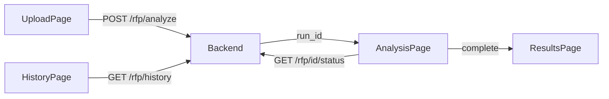
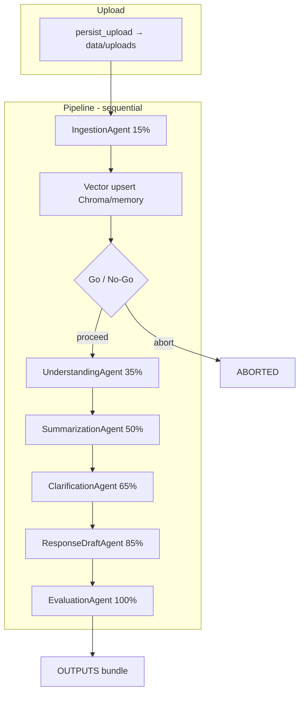

# Pre-Sales Agent — Project Guide

This document describes **project structure**, **how the system works**, **files you need to run it**, and the **end-to-end flow** from RFP upload to results.

For install commands, see [README.md](README.md).

---

## 1. What this project does

The **Pre-Sales AI Agent** ingests a Request for Proposal (RFP) document (TXT, PDF, or DOCX), runs a **multi-agent pipeline**, and produces:

| Output | Description |
|--------|-------------|
| **Requirements** | Structured list with IDs, priority, MAF level, ambiguity score |
| **Executive summary** | Client overview, objectives, risks, bid strategy |
| **Clarifying questions** | Questions to email the client before bidding |
| **Draft response** | Sectioned proposal draft |
| **MAF audit** | Minimum / Acceptable / Full gate and blockers |

The **React** UI uploads files and polls progress. The **FastAPI** backend orchestrates agents, calls the LLM, and optionally stores chunks in a **vector store** (Chroma) for retrieval during drafting.

---

## 2. Repository structure

```
presales-agent/
├── .env                    # Local config (create from .env.example) — REQUIRED for real LLM/RAG
├── .env.example            # Template for environment variables
├── README.md               # Quick start and install
├── PROJECT_GUIDE.md        # This file
│
├── backend/                # Python FastAPI service
│   ├── main.py             # App entry, CORS, routers, lifespan
│   ├── requirements.txt    # Core Python dependencies
│   ├── requirements-chroma.txt  # Optional: ChromaDB vector store
│   │
│   ├── core/
│   │   ├── config.py       # Settings from .env (paths, LLM, vector store)
│   │   ├── llm.py          # Ollama / Azure / mock chat + JSON parsing
│   │   ├── agent_runtime.py  # Microsoft Agent Framework bootstrap
│   │   └── logging.py      # Structured logging
│   │
│   ├── routers/
│   │   ├── rfp.py          # REST: analyze, status, output, history, WebSocket
│   │   └── health.py       # Health check
│   │
│   ├── orchestrator/
│   │   └── pipeline.py     # Runs agents in order; RUNS / OUTPUTS in memory
│   │
│   ├── agents/             # One module per pipeline stage
│   │   ├── ingestion_agent.py
│   │   ├── understanding_agent.py
│   │   ├── summarization_agent.py
│   │   ├── clarification_agent.py
│   │   ├── response_agent.py
│   │   └── evaluation_agent.py
│   │
│   ├── models/
│   │   ├── rfp.py          # RFPDocument, Requirement, Summary, Draft, Questions
│   │   ├── pipeline.py     # PipelineState, OutputBundle, statuses
│   │   └── maf.py          # MAF audit models
│   │
│   ├── parsers/
│   │   ├── pdf_parser.py
│   │   └── docx_parser.py
│   │
│   ├── rag/
│   │   ├── retrieval.py    # Memory or Chroma vector store
│   │   └── embeddings.py
│   │
│   └── tests/              # pytest smoke + LLM JSON tests
│
├── frontend/               # React 18 + TypeScript + Vite + Fluent UI
│   ├── src/
│   │   ├── main.tsx
│   │   ├── app/
│   │   │   ├── App.tsx           # Routes
│   │   │   └── AppLayout.tsx     # Shell / navigation
│   │   ├── pages/
│   │   │   ├── UploadPage.tsx    # Drop RFP → POST analyze
│   │   │   ├── AnalysisPage.tsx  # Poll status while running
│   │   │   ├── ResultsPage.tsx   # Tabs: summary, reqs, questions, draft, audit
│   │   │   └── HistoryPage.tsx   # List past runs (same process memory)
│   │   ├── api/
│   │   │   └── client.ts         # Axios → /api/v1/rfp/*
│   │   └── types/
│   │       └── output.ts         # TypeScript shapes for API output
│   └── package.json
│
├── specs/                  # Spec Kit–style YAML/MD (design contracts, not runtime code)
│   ├── vision-presales-v1.yaml
│   ├── features/           # feat-ingest, feat-understand, …
│   ├── tasks/              # task-chunk, task-req-extract, …
│   ├── outputs/            # output-req-list, output-summary, …
│   └── prompts/            # prompt-summarize-v1.md, …
│
├── samples/                # Example RFPs for testing
│   └── sample-rfp-it-services.txt
│
├── scripts/
│   └── validate_specs.py   # Validates specs/ YAML in CI
│
└── data/                   # Created at runtime (gitignored)
    ├── uploads/            # Saved upload files (UUID filenames)
    └── chroma/             # Chroma persistence when VECTOR_STORE_BACKEND=chroma
```

---

## 3. Files you need to run the project

### Required

| File / folder | Purpose |
|---------------|---------|
| **`.env`** (repo root) | Copy from `.env.example`. Controls LLM, vector store, data paths. |
| **`backend/requirements.txt`** | Install with `pip install -r requirements.txt` inside a venv. |
| **`backend/main.py`** | Start API: `uvicorn main:app --reload` from `backend/`. |
| **`frontend/package.json`** | Install with `npm install`; run `npm run dev`. |

### Required for real LLM (not mock)

| Dependency | When |
|------------|------|
| **Ollama** running locally | `LLM_BACKEND=ollama` in `.env` |
| Model pulled | e.g. `ollama pull llama3.2` (match `OLLAMA_MODEL`) |

### Optional but recommended for RAG

| File | Purpose |
|------|---------|
| **`backend/requirements-chroma.txt`** | ChromaDB when `VECTOR_STORE_BACKEND=chroma` |
| **`data/chroma/`** | Auto-created; persists embeddings between restarts |

### Not required at runtime

| Path | Role |
|------|------|
| `specs/` | Documentation / validation; agents embed logic in Python, not by loading YAML at runtime |
| `samples/` | Test data only |
| `.specify/memory/constitution.md` | Spec Kit principles |

---

## 4. Configuration (`.env`)

Loaded by `backend/core/config.py` from **repository root** `.env` first, then `backend/.env` if present. Paths like `DATA_DIR` and `CHROMA_PERSIST_DIR` resolve **relative to repo root**, not the shell cwd.

| Variable | Typical value | Meaning |
|----------|---------------|---------|
| `LLM_BACKEND` | `groq` / `ollama` / `mock` / `azure_openai` | Which LLM client to use |
| `GROQ_API_KEY` | (from console.groq.com) | Groq API key when using `groq` |
| `GROQ_MODEL` | `llama-3.3-70b-versatile` | Groq model id |
| `OLLAMA_BASE_URL` | `http://127.0.0.1:11434` | Ollama OpenAI-compatible API |
| `OLLAMA_MODEL` | `llama3.2` | Ollama model name |
| `OLLAMA_TIMEOUT_SECONDS` | `600` | Long timeout for slow CPU inference |
| `LLM_FALLBACK_ON_ERROR` | `true` / `false` | Heuristic fallback vs hard fail on LLM errors |
| `VECTOR_STORE_BACKEND` | `chroma` / `memory` | Chunk storage for draft retrieval |
| `CHROMA_PERSIST_DIR` | `data/chroma` | Chroma files on disk |
| `DATA_DIR` | `data/uploads` | Uploaded RFP files |
| `JWT_SECRET` | any string | Reserved for future auth |

Restart **uvicorn** after changing `.env`.

---

## 5. End-to-end flow

### User journey (UI)



1. User selects **TXT / PDF / DOCX** on `/` (`UploadPage.tsx`).
2. Frontend calls `analyzeRfp()` → `POST /api/v1/rfp/analyze` with multipart file.
3. Backend saves file under `data/uploads/`, starts pipeline, returns **`run_id`**.
4. UI navigates to `/analysis/:runId` and polls **`GET /api/v1/rfp/{run_id}/status`** until `complete`, `failed`, or `aborted`.
5. UI opens `/results/:runId` and loads **`GET /api/v1/rfp/{run_id}/output`** (summary, requirements, questions, draft, audit).

Vite dev server proxies `/api` → `http://127.0.0.1:8000`.

### Backend pipeline (agents)

Orchestrator: `backend/orchestrator/pipeline.py` (`PipelineOrchestrator._execute_pipeline`).



| Step | Agent | Progress | Main output |
|------|--------|----------|-------------|
| 1 | `IngestionAgent` | 15% | `RFPDocument` (text, chunks, sections) |
| — | Vector store | — | `upsert(chunks)` for RAG in draft step |
| 2 | Go/No-Go | — | Abort if document empty |
| 3 | `UnderstandingAgent` | 35% | `RequirementList` |
| 4 | `SummarizationAgent` | 50% | `RFPSummary` |
| 5 | `ClarificationAgent` | 65% | `QuestionList` |
| 6 | `ResponseDraftAgent` | 85% | `DraftResponse` (may query vector store) |
| 7 | `EvaluationAgent` | 100% | `MAFAuditResult`; builds `OutputBundle` |

**Status values:** `pending` → `running` → `complete` | `failed` | `aborted`.

On success, `OUTPUTS[run_id]` holds the full `OutputBundle`. On MAF minimum not met, status may be `failed` with blockers in `error`.

### LLM and JSON

Most agents call `OpenAICompatibleClient.chat_json()` in `backend/core/llm.py`:

- Sends system + user prompts; asks model for **JSON only**.
- Parses fences, truncated JSON, and array roots via `_extract_json`.
- Optional **repair** retry if parsing fails.
- Backends: **Groq** (`response_format: json_object`), **Ollama** (`format: json`), **Azure OpenAI** (`response_format: json_object`), or **mock** (no network).

---

## 6. API reference (RFP router)

Base path: **`/api/v1/rfp`** (`backend/routers/rfp.py`).

| Method | Path | Description |
|--------|------|-------------|
| `POST` | `/analyze` | Upload file; returns `{ "run_id": "..." }` |
| `GET` | `/{run_id}/status` | `{ status, progress, error? }` |
| `GET` | `/{run_id}/output` | Full `OutputBundle` when ready |
| `GET` | `/{run_id}/summary` | Summary only |
| `GET` | `/{run_id}/questions` | Questions list |
| `GET` | `/{run_id}/draft` | Draft sections |
| `GET` | `/history` | All runs in current server process |
| `POST` | `/{run_id}/feedback` | Placeholder |
| `WS` | `/{run_id}/stream` | Poll-based event stream |

Interactive docs: `http://127.0.0.1:8000/docs` when the backend is running.

---

## 7. Data persistence

| Data | Where | Survives restart? |
|------|--------|-------------------|
| Uploaded RFP files | `data/uploads/` (UUID filenames) | **Yes** |
| Chroma embeddings | `data/chroma/` | **Yes** (if `chroma` backend) |
| Run status + results | In-memory `RUNS` / `OUTPUTS` in `pipeline.py` | **No** — new `run_id` after server restart; old IDs return **404** |
| History page | Reads `/rfp/history` from same in-memory dict | Same as runs |

To keep results across restarts, you would add disk or database persistence for `RUNS` / `OUTPUTS` (not in the default scaffold).

---

## 8. How `specs/` relates to code

The `specs/` folder follows a **Spec Kit** layout: vision, features, tasks, outputs, and prompt markdown files. They define **intent and contracts** for humans and CI (`scripts/validate_specs.py`).

| Spec area | Example | Implemented in |
|-----------|---------|----------------|
| Ingest / chunk | `task-ingest-v1.yaml`, `task-chunk-v1.yaml` | `ingestion_agent.py` |
| Requirements | `task-req-extract-v1.yaml` | `understanding_agent.py` |
| Summary | `task-summarize-v1.yaml`, `prompt-summarize-v1.md` | `summarization_agent.py` |
| Questions | `task-question-gen-v1.yaml` | `clarification_agent.py` |
| Draft | `task-draft-section-v1.yaml` | `response_agent.py` |
| MAF audit | `task-maf-audit-v1.yaml` | `evaluation_agent.py` |

Agents use **inline prompts** in Python; specs are the source of truth for **what** to build, not loaded at runtime unless you add that later.

---

## 9. Key modules (quick map)

| Module | Responsibility |
|--------|----------------|
| `main.py` | FastAPI app, CORS, router mount, Agent Framework runtime on startup |
| `routers/rfp.py` | HTTP API for analyze / status / output / history |
| `orchestrator/pipeline.py` | Agent sequencing, progress, `RUNS` / `OUTPUTS` |
| `core/llm.py` | HTTP to LLM + robust JSON extraction |
| `core/config.py` | Environment settings |
| `rag/retrieval.py` | `memory` vs `chroma` vector store factory |
| `agents/*.py` | Business logic per pipeline stage |
| `models/*.py` | Pydantic schemas shared by API and agents |
| `frontend/src/api/client.ts` | All browser → API calls |
| `frontend/src/pages/*.tsx` | UI screens per route |

---

## 10. Local run checklist

1. Copy `.env.example` → `.env` at repo root; set `LLM_BACKEND` and paths.
2. **Backend:** `cd backend` → venv → `pip install -r requirements.txt` (+ `requirements-chroma.txt` if needed) → `uvicorn main:app --reload --host 127.0.0.1 --port 8000`.
3. **Ollama (if used):** `ollama serve` and `ollama pull <OLLAMA_MODEL>`.
4. **Frontend:** `cd frontend` → `npm install` → `npm run dev` → open `http://127.0.0.1:5173`.
5. Upload `samples/sample-rfp-it-services.txt` or your own RFP.
6. Wait for pipeline completion (can take many minutes on CPU with local models).

**Tests:** from `backend/`, run `pytest tests/ -q` (uses `LLM_BACKEND=mock` in smoke test).

---

## 11. Troubleshooting

| Symptom | Likely cause |
|---------|----------------|
| 404 on status after restart | Run state was in memory only; upload again |
| Stuck at 15% / 35% / 50% | Ollama slow or timing out; increase `OLLAMA_TIMEOUT_SECONDS` |
| `LLMError` / JSON errors | Model returned invalid JSON; try a stronger model or `LLM_FALLBACK_ON_ERROR=true` |
| Empty or placeholder questions | Weak model + bad JSON; check prompts in `clarification_agent.py` |
| Chroma import errors on Windows | Install `requirements-chroma.txt` (Chroma 1.x wheels) |

---

*Last updated to match the repository layout and `pipeline.py` orchestration flow.*
